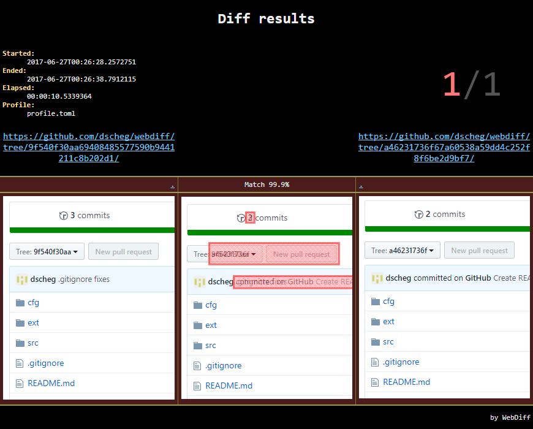

# WebDiff
WebDiff is a configurable .NET command-line tool for comparing two sites by list of URLs.

### Features
* Firefox, Chrome support
* Full page screenshots (vertical scrolling)
* Window sizes, Chrome mobile emulation
* Dynamic content waiting
* Injecting CSS/JS [WebExtension]
* Modifying HTTP-headers [WebExtension]
* Cookies
* HTML report with diff results



### Build
Requirements:
* Visual Studio 2017
* PowerShell v5+

```
git clone https://github.com/dscheg/webdiff
cd webdiff
build.bat
```

### Usage
```
Usage: webdiff [OPTIONS] URL1 URL2 [FILE]
Options:
  -o, --output=VALUE         Reports output directory
                               (default: '.')
  -p, --profile=VALUE        Profile TOML file with current settings
                               (default: 'profile.toml')
  -t, --template=VALUE       HTML report template file
                               (default: 'template.html')
  -h, --help                 Show this message

Examples:
  webdiff http://prod.example.com http://test.example.com < URLs.txt
  webdiff -p profile.toml -t template.html -o data http://prod.example.com http://test.example.com URLs.txt
```

### Config
* profile.toml
* cookies.txt
* ext/inject.{js|css}
